# LoadPilot user guide

LoadPilot runs your JMeter load tests from a web page. You upload a `.jmx` test plan, pick which office PCs should generate the load, press **Start**, and watch the results live. When the test ends you get the full report: response times, errors with the real request and response, per-agent numbers, and a pass/fail verdict.

You don't need JMeter installed on your own PC. Everything happens on the **controller** (one PC that runs LoadPilot) and the **agents** (the office PCs that send the requests).

> The screenshots in this guide come from a demo setup: three agents named `Lab-PC-01…03` testing the small demo site in `sample/`. Your screens will show your own agents and plans.

## Contents

- [Before you start](#before-you-start)
- [Your first load test (quick version)](#your-first-load-test-quick-version)
- [The screens, one by one](#the-screens-one-by-one)
  - [Home](#home)
  - [New run, step 1: Plan](#new-run-step-1-plan)
  - [New run, step 2: Workload](#new-run-step-2-workload)
  - [New run, step 3: Agents and data files](#new-run-step-3-agents-and-data-files)
  - [New run, step 4: Review and start](#new-run-step-4-review-and-start)
  - [Live monitor](#live-monitor)
  - [Run detail (the results)](#run-detail-the-results)
  - [Errors tab](#errors-tab)
  - [Runs and Compare](#runs-and-compare)
  - [Schedules](#schedules)
  - [Reports](#reports)
  - [Agents & teams](#agents--teams)
  - [Settings](#settings)
- [How-to recipes](#how-to-recipes)
- [What LoadPilot can and can't do](#what-loadpilot-can-and-cant-do)
- [Troubleshooting](#troubleshooting)

---

## Before you start

1. **The controller must be running.** Open `http://<controller-PC-IP>:4000` in any browser on the office network (ask whoever looks after LoadPilot for the address). If the page doesn't load, the controller is stopped. Start `loadpilot-controller.exe` (or the LoadPilot desktop shortcut) on the controller PC.
2. **Agents must be switched on and connected.** Each worker PC runs a small background program (the agent) that starts with Windows. Connected agents appear on **Home** and under **Agents & teams**.
3. **Have your test plan ready.** Any `.jmx` file that runs in JMeter, plus the CSV files it reads.

> Only send load to systems you're allowed to test. A load test with many users looks the same as an attack to the server on the other end.

---

## Your first load test (quick version)

1. Click **New run**.
2. **Plan**: drop your `.jmx` file on the box (or pick a recent plan), then **Continue**.
3. **Workload**: set the number of users, ramp-up and how long to run for each thread group. Untick requests you don't want. **Continue**.
4. **Agents**: tick the PCs that should send load. Attach each CSV file the plan asks for. **Continue**.
5. **Review**: check the summary and the pre-flight checks, then click **Start load test**.
6. Watch the **Live monitor**. When it finishes, click **Open full results**.

The rest of this guide explains each screen in detail.

---

## The screens, one by one

### Home

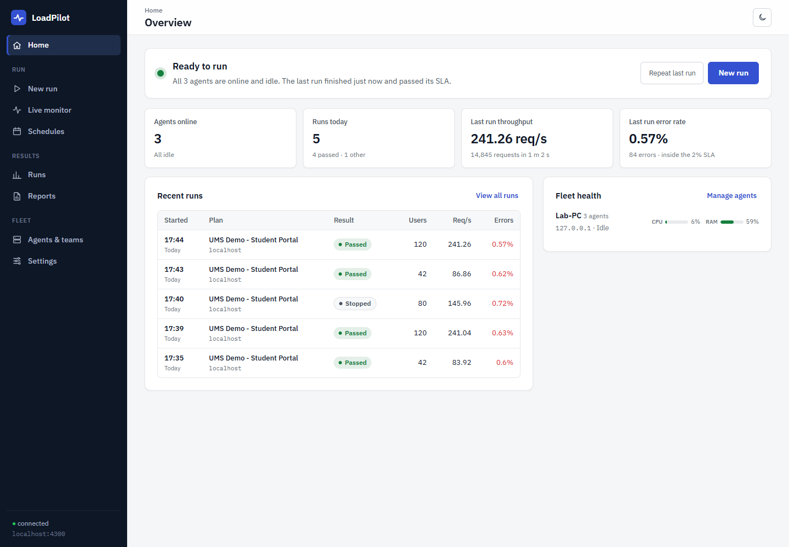

The overview at a glance:

- **The top banner** says whether you're ready to run. It warns you if agents are offline or a test is already running. **Repeat last run** opens the last test again, ready to start.
- **Agents online / Runs today / Last run throughput / Last run error rate** are quick health numbers.
- **Recent runs**: click a row to open its results.
- **Fleet health** groups agents by PC with live CPU and RAM. A PC near its limit gives unreliable numbers (see [What it can't do](#what-it-cant-do)).

### New run, step 1: Plan

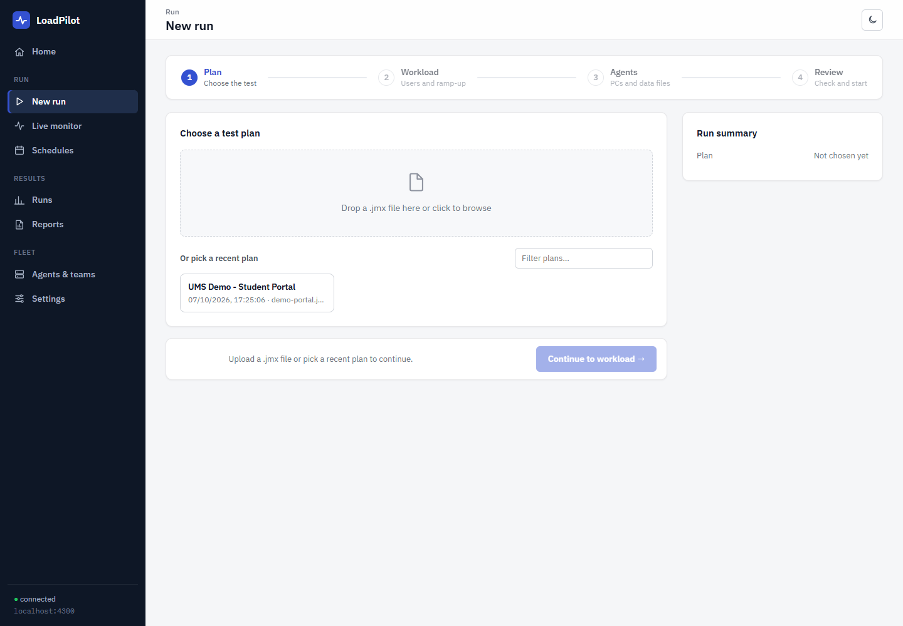

- **Drop a `.jmx` file** on the box, or click it to browse.
- **Or pick a recent plan.** Every plan you upload is kept, so you can pick it again without uploading. Use **Filter plans…** to search.

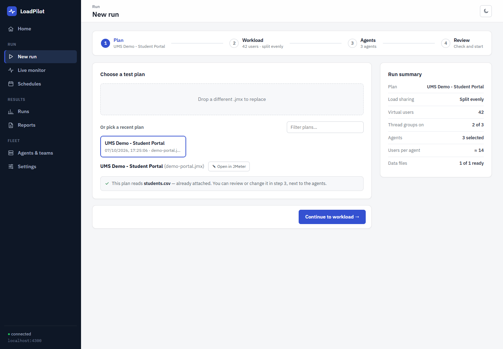

Once the plan is loaded:

- LoadPilot tells you which **data files** (CSV) the plan reads. You attach them in step 3.
- **Open in JMeter** opens a copy of the plan in JMeter *on the controller PC*. Edit it, save with Ctrl+S, then click **Import edited plan**. Your original plan stays unchanged. This only helps if you're sitting at the controller PC.
- The **Run summary** on the right fills in as you go through the steps.

### New run, step 2: Workload

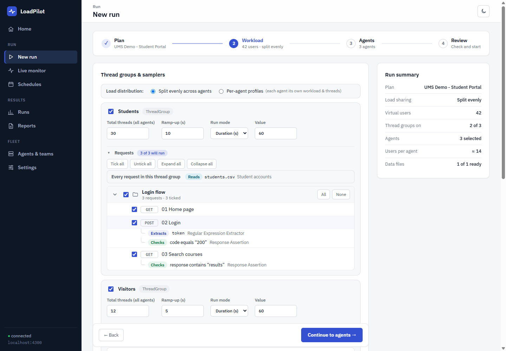

**Load distribution**

- **Split evenly across agents**: you set the *total* users for the whole test, and LoadPilot divides them between the agents. Example: 30 users on 3 agents = 10 each.
  - setUp and tearDown thread groups are not divided; each agent runs them in full.
  - Rate-based (bzm Arrivals) groups split their rate as a fraction, so no agent gets 0.
- **Per-agent profiles**: each agent gets its own workload, with its own users, thread groups and requests. Use **Copy to all** to start every agent from the same settings.

**For each thread group**

- Tick or untick the whole thread group. Thread groups switched off in the plan start unticked (like *Admin reports* above).
- **Total threads (all agents)**: the number of virtual users.
- **Ramp-up (s)**: how long it takes to start them all.
- **Run mode**: either **Duration (s)** (run for that long) or **Loop count** (each user repeats the steps that many times).

**The request tree** shows every request in the thread group, in order, with what belongs to it:

| Tag | Meaning |
|---|---|
| **Reads** | takes test data from a CSV file (shown for the whole thread group, or for one request) |
| **Before** | a pre-processor that runs just before its request |
| **Extracts** | saves a value from the response, e.g. a login token, for later requests |
| **Checks** | an assertion that passes or fails the request |
| **After** | a post-processor that runs after its request |

Tick or untick single requests, or whole controllers with **All** / **None**. The badge (*3 of 3 will run*) keeps count. **Expand all** / **Collapse all** open or close the folders.

> If you untick a request that *Extracts* a value (like a login that saves a token), the requests that use that value will fail.

**Variables** lets you change the plan's User Defined Variables for this run only, for example the host name. Values you don't touch keep the plan's original.

**Run options**

- **JVM heap per agent**: the memory each agent's JMeter may use. 2g–4g is plenty for most tests. Use more only for very large tests.
- **Live update every**: how often the Live monitor refreshes.

### New run, step 3: Agents and data files

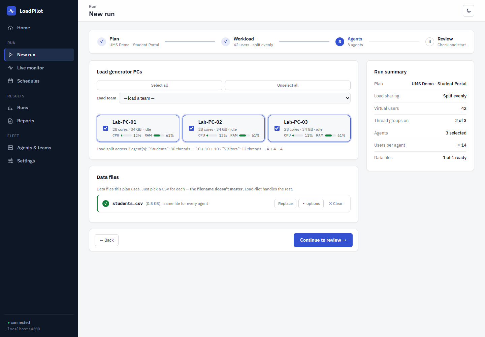

**Load generator PCs**

- Tick the agents that should send load. Only **idle** agents can be ticked; busy or offline ones are greyed out.
- **Load team** ticks a saved group of agents in one click (see [Teams](#agents--teams)).
- The line under the cards shows exactly how the users will be shared out.
- Each card shows the PC's CPU and RAM. Avoid PCs that are already busy.

**Data files**

There's one row for each CSV file the plan needs. Click **Choose file** and pick your CSV; the file name doesn't matter, LoadPilot puts it where the plan expects it. Uploaded files are kept for next time.

Under **options** you choose how the file reaches the agents:

| Option | What each agent gets | Use it when |
|---|---|---|
| **Same file for every agent** | the whole file | it's fine for agents to use the same rows (e.g. search terms) |
| **Split rows across agents** | its own share of the rows | each virtual user must log in with a different account |
| **A different file per agent** | a file you pick for that agent | you've prepared separate account lists per PC |

> **Check the first row of your CSV.** The column names must match the variable names in the plan's CSV Data Set Config. If the website renames a login field, update the CSV header too. Otherwise every request sends the old name and fails.

### New run, step 4: Review and start

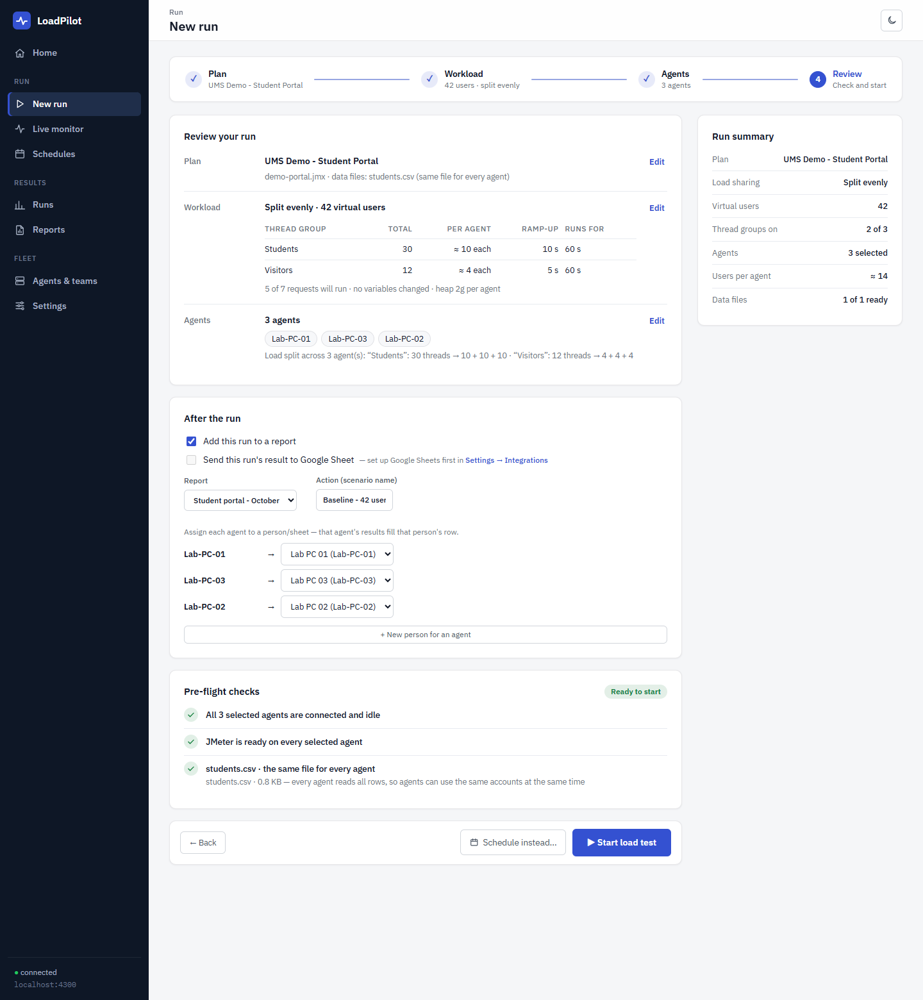

- **Review your run** sums up the plan, workload and agents. Click **Edit** on any line to go back to that step.
- **After the run**
  - **Add this run to a report**: puts the results into a report (see [Reports](#reports)). Pick the report, type the scenario name (*Action*), and assign each agent to a person or sheet. Agents linked to a person are assigned automatically. An agent left on **skip** adds nothing to the report.
  - **Send this run's result to Google Sheet**: only if Google Sheets is set up in **Settings → Integrations**.
- **Pre-flight checks** catch problems before you start, such as an agent that disconnected, JMeter not ready, a missing CSV file, or agents that would get identical account lists. **Start load test** is blocked if nothing would actually run.
- **Schedule instead…** saves the whole setup as a schedule rather than starting now (see [Schedules](#schedules)).

### Live monitor

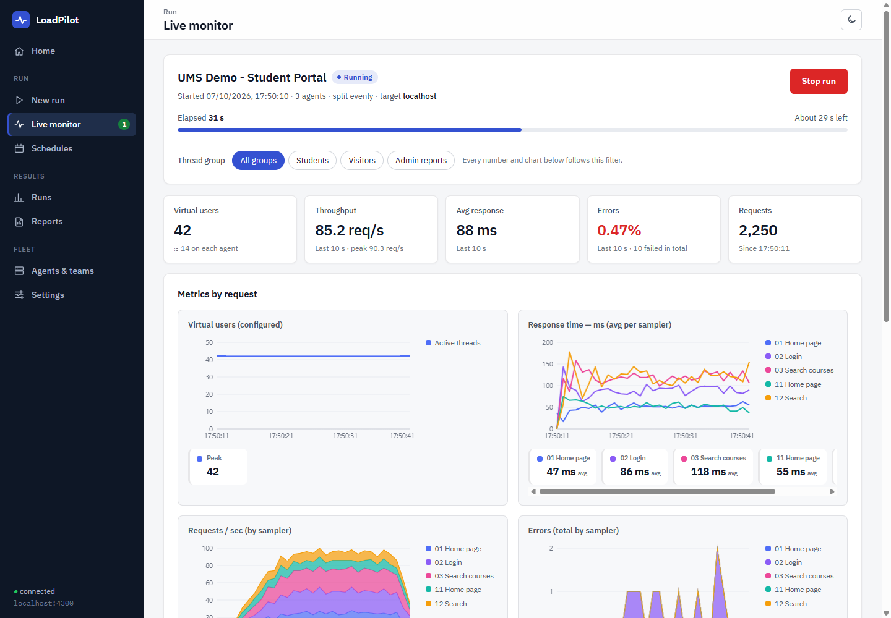

While the test runs:

- **The header** shows the status, start time, agents and target, and a progress bar with the time left.
- **Stop run** asks you to confirm (**Stop run** / **Keep running**). Agents stop within a few seconds, and all results collected so far are kept. The run is marked *Stopped*.
- **The thread group pills** filter every number and chart on the page to one group.
- **The tiles** show virtual users, throughput, average response and error rate (all over the last 10 seconds), plus total requests.
- **The charts** show virtual users, response time per request, requests per second per request, and errors per request.

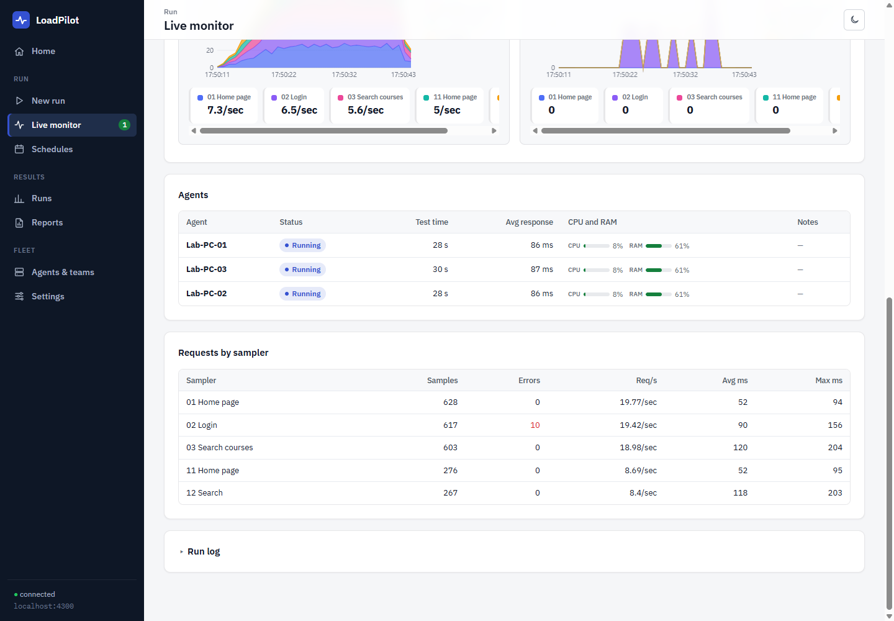

- **Agents** shows each PC's status, test time, average response and CPU/RAM. A note appears if a PC is near its CPU or RAM limit, or if one agent is much slower than the others (usually a slow network path from that PC).
- **Requests by sampler** gives per-request counts, errors and timings.
- **Run log** shows what the agents reported: downloads, JMeter starting, uploads.

> Live numbers are a fast preview. The final, exact numbers come from the agents' full result files once the run finishes, so they can differ slightly from the last live values.

### Run detail (the results)

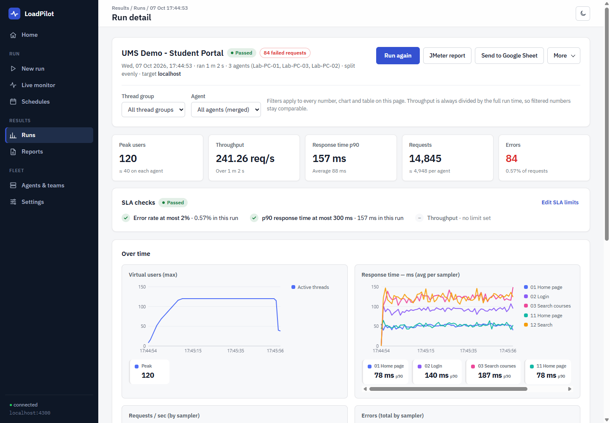

Open it from **Runs**, **Home**, or **Open full results** on the Live monitor.

- **The badges**:
  - **Passed** or **Failed SLA** for a finished run, judged against your [SLA limits](#settings); otherwise **Stopped** or **Error**.
  - The failed-request count, if there were failures.
- **Run again** opens New run with the same plan, workload, variables and agents, ready on the Review step. Nothing starts until you press Start.
- **JMeter report** opens JMeter's own HTML dashboard for this run, when available.
- **More** has **Download results (.jtl)**, **Open run log**, **Print report** and **Delete run**. Deleting is permanent.
- **Thread group** and **Agent** filters apply to every number, chart and table on the page.
- **The tiles** are:
  - **Peak users**: all agents added together.
  - **Throughput**.
  - **Response time p90**: 90% of requests were faster than this.
  - **Requests** and **Errors**.
- **SLA checks** show each limit and the run's value. **Edit SLA limits** changes the limits for *every* run.

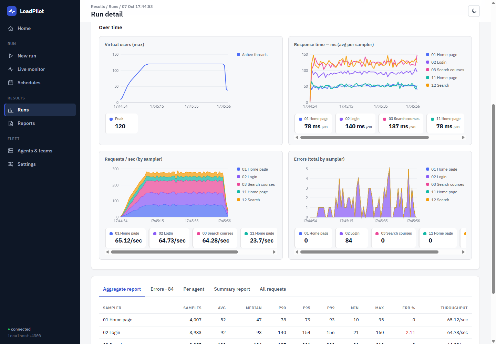

**Over time** shows how virtual users, response times, requests per second and errors moved during the test. Hover a chart to see the exact values at that moment.

The tabs underneath:

| Tab | What's in it |
|---|---|
| **Aggregate report** | per request: samples, average, median, p90/p95/p99, min, max, error %, throughput (the same as JMeter's Aggregate Report) |
| **Errors** | every failure grouped by type, with the real request and response (see next section) |
| **Per agent** | each agent's share: samples, timings, error %, throughput |
| **Summary report** | JMeter's Summary Report columns, including KB/s and average bytes |
| **All requests** | every single request in time order. Click a row for its URL, response code and failure message, or tick *Failed requests only* |

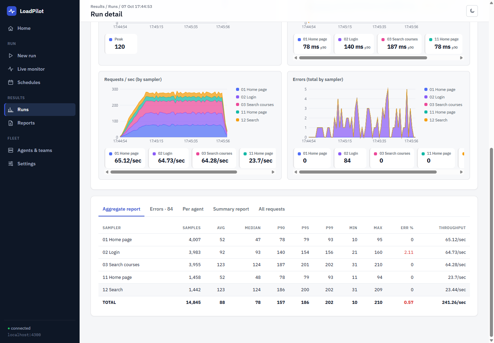

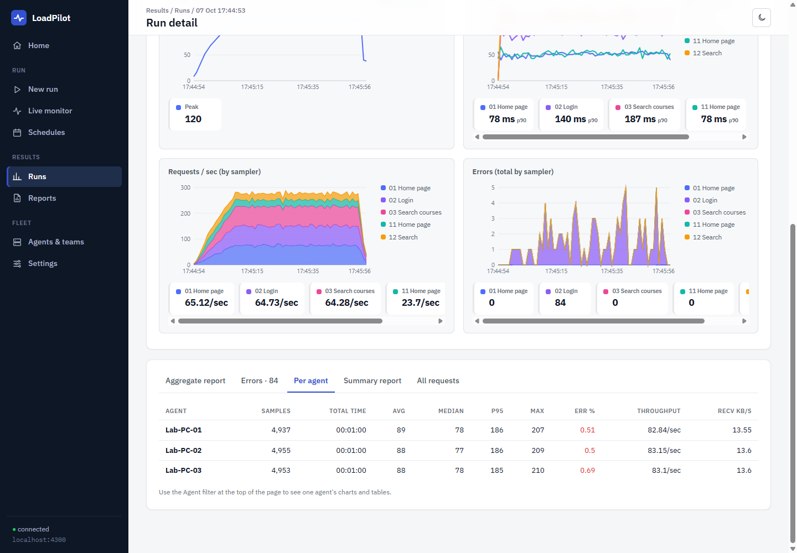

> Redirect sub-samples (for example `Login-0`, `Login-1`) are left out of the counts, as JMeter's own reports do. Their time is already inside the parent request.

### Errors tab

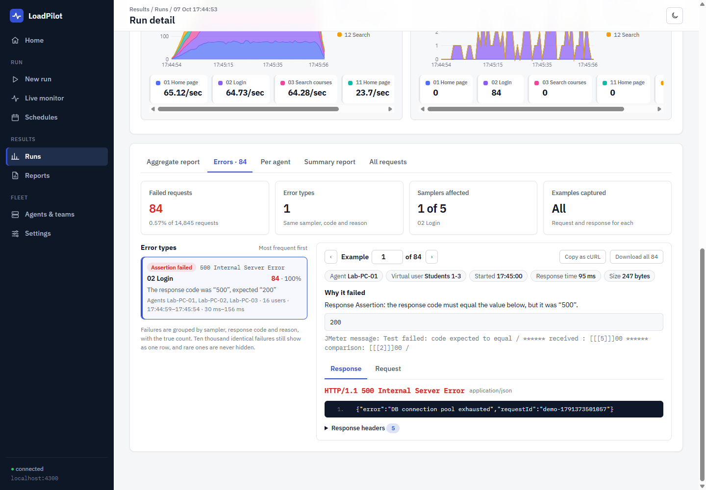

The fastest way to understand *why* requests failed:

- **The tiles** show failed requests, how many different error types there are, which requests are affected, and how many examples were captured.
- **Error types** groups failures by request, response code and reason, with the true count. Ten thousand identical failures are one row, and rare ones are never hidden.
- **The example viewer** pages through every captured failure (**‹ ›** or type a number).
  - For each example you see the agent, the virtual user, the time, the response time and the size.
  - **Why it failed** explains the assertion in plain words, e.g. *the response code must equal 200, but it was 500*.
  - **Response** shows the status line, headers and body (an HTML page is previewed safely). **Request** shows what was sent, including form fields and headers.
  - **Copy as cURL** lets you repeat that exact request from a terminal. **Download all** saves every example of that type.
- **Plan problems** are flagged for you:
  - a request that sent `NOT_FOUND`, meaning an extractor didn't find its value (often because an earlier step like login failed);
  - a literal `${variable}`, meaning the variable was never set;
  - many different users sending the same account, meaning the CSV wasn't used.

### Runs and Compare

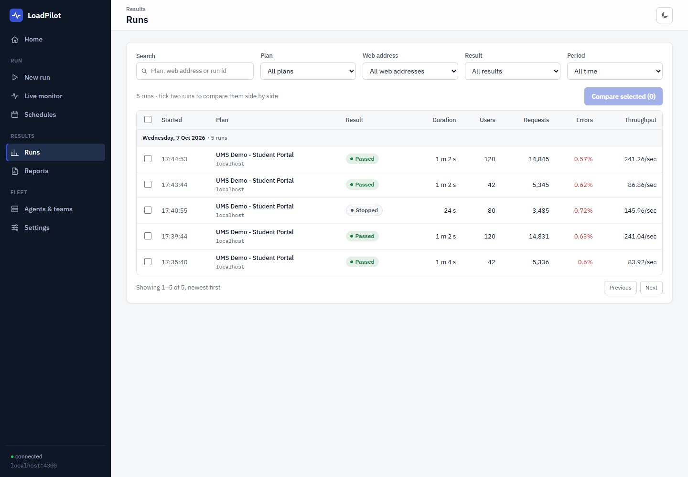

Every run, newest first, grouped by day.

- **Search** by plan, web address or run id, and filter by **Plan**, **Web address**, **Result** (passed, failed, stopped…) and **Period**.
- Click a row to open its results.
- Tick runs to **Delete selected**, or tick exactly two to **Compare selected**.

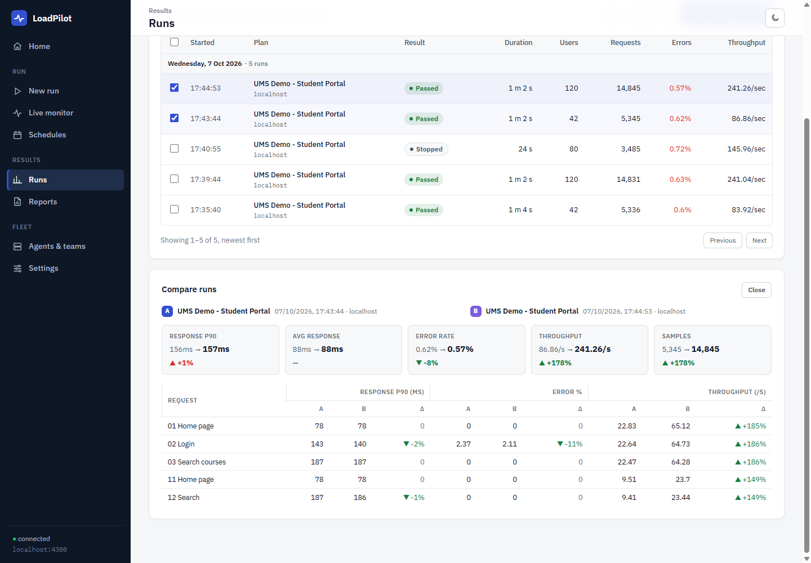

**Compare** puts run A next to run B: p90, average response, error rate, throughput and samples, with the change in %. The table below compares each request. Green arrows mean better, red mean worse. Use it to compare before and after a release, or a baseline against a peak load.

### Schedules

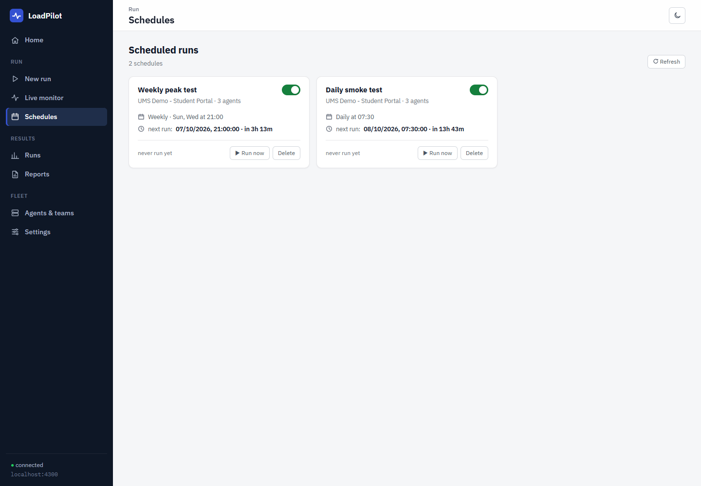

- **To create a schedule**, set up a run as usual, then on step 4 click **Schedule instead…** and choose **Daily**, **Weekly** (pick the days) or **Once**, and a time.
- **The toggle** pauses or resumes a schedule. **Run now** starts it immediately. **Delete** removes it.
- **A schedule only starts if**:
  - the controller is running at that time;
  - no other test is running (otherwise that time is *skipped*);
  - at least one of its agents is connected. Agents that are missing are left out.
- Times use the **controller PC's clock**. If the controller was off at the scheduled time, the run starts once when it comes back, as long as its agents are connected.

### Reports

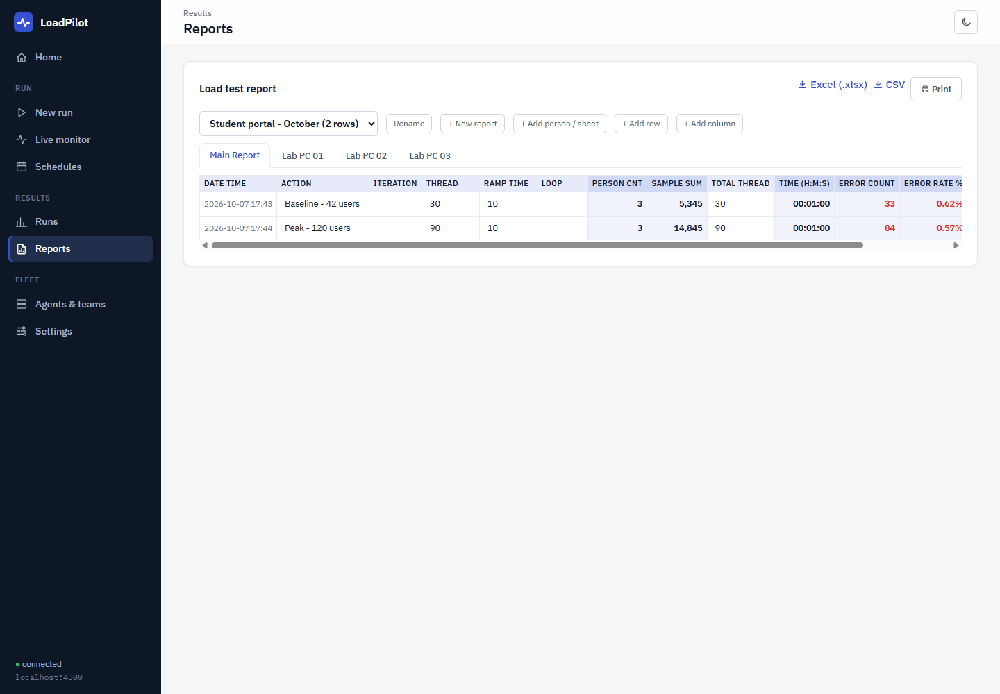

A report is a spreadsheet-style record of many runs, the same layout as the team's Excel load-test report.

- **Main Report** has one row per run (scenario), with totals worked out from the person sheets.
- **One tab per person or sheet** (**+ Add person / sheet**). Link a person to an agent and that agent's results fill their row automatically.
- Runs are added with **Add this run to a report** on step 4. You can also **+ Add row** and **+ Add column** by hand and edit cells directly.
- **Excel (.xlsx)** and **CSV** download the report. **Print** prints every sheet.

> If a report row shows zeros, the agents were left on **skip** when the run was added. Link the agents to people (or assign them on step 4) next time.

### Agents & teams

**Agents**

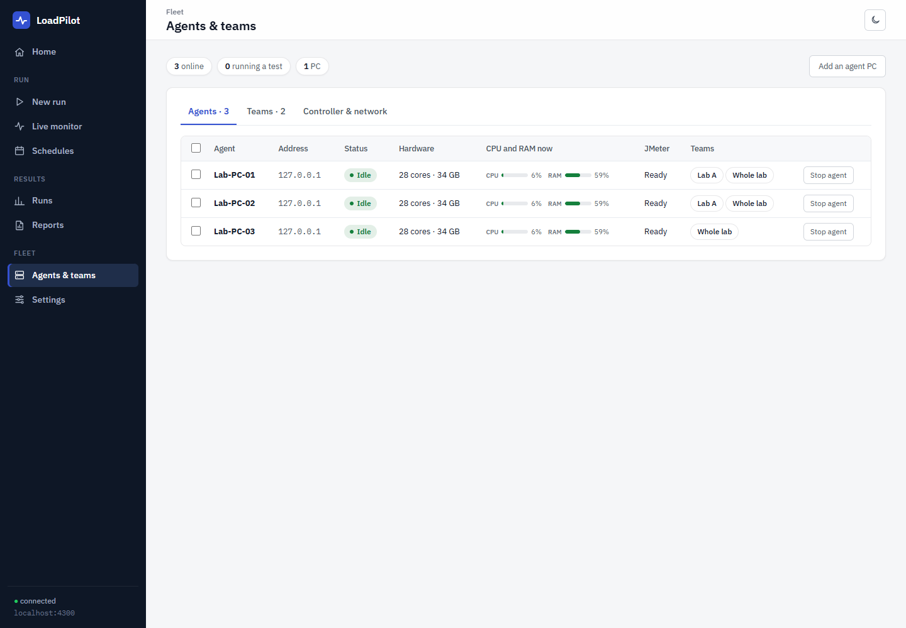

- Every connected agent with its address, status, hardware, live CPU/RAM, whether JMeter is ready (an agent downloads it on its first run), and its teams.
- **Stop agent** stops the agent program on that PC. Start it there again (or restart the PC) to bring it back.
- **Add an agent PC** shows how to set up a new worker PC.

**Teams**

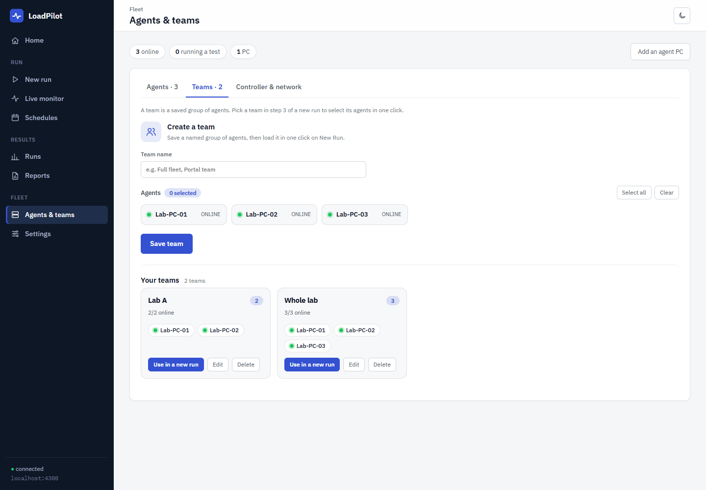

A team is a saved group of agents, e.g. *Lab A* or *Whole lab*. Create one here, then pick it in **Load team** on step 3, or click **Use in a new run**.

**Controller & network**

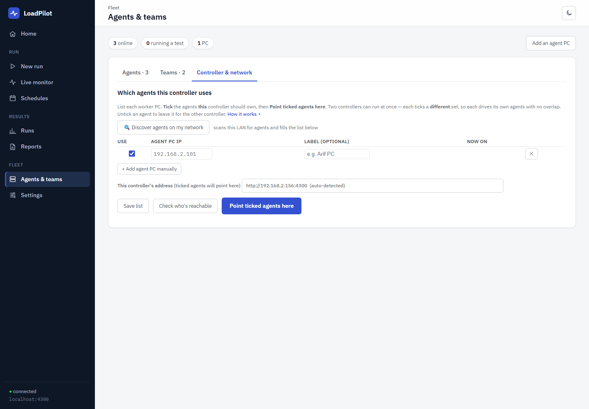

For moving agents between controllers.

- **Discover agents on my network** scans the LAN for agents. You can also **+ Add agent PC manually** by IP.
- Tick the agents this controller should use and click **Point ticked agents here**. They switch over within seconds and remember it after a restart.
- Two controllers can run side by side if each ticks a different set of agents.
- **Check who's reachable** pings the listed PCs.

### Settings

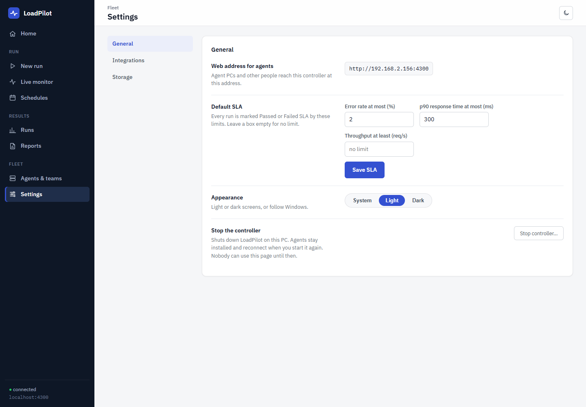

**General**

- **Web address for agents**: the address agent PCs and other people use to reach this controller.
- **Default SLA**: the limits every run is judged by (error rate at most %, p90 at most ms, throughput at least req/s). Leave a box empty for no limit.
- **Appearance**: Light, Dark or follow Windows. There's also a moon/sun button at the top right of every page.

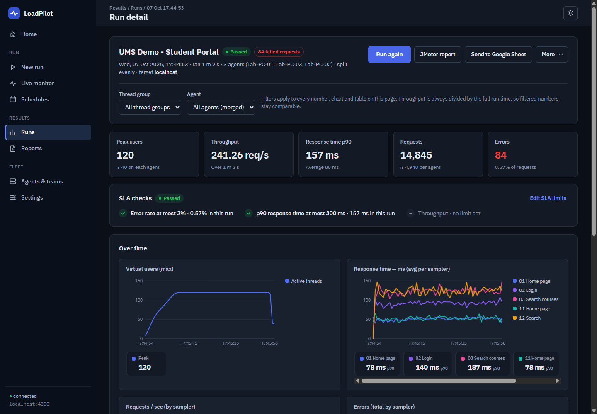

- **Stop the controller**: shuts LoadPilot down on the controller PC. If a test is running it asks again, and stopping anyway tells the agents to stop first. Every open LoadPilot page shows a red *controller has stopped* banner and reconnects by itself once the controller is started again.

**Integrations: Google Sheets** sends each finished run's results as a new row in a Google Sheet. It needs a one-time setup: follow **Show one-time setup steps**, use **Copy code** for the Apps Script, then **Send test row**.

**Storage** shows where LoadPilot keeps plans, results, the JMeter bundle and so on. Changing a folder takes effect after the controller restarts, and existing files are not moved for you.

---

## How-to recipes

**Give every virtual user a different login.** Put one account per row in a CSV (header row first, e.g. `studentId,password`). On step 3 attach it and set **options → Split rows across agents**. Make sure there are at least as many rows as users. If you give agents identical files, the pre-flight checks warn you that their users would share accounts.

**Run only some requests.** On step 2, untick the requests (or whole controllers) you don't want. Keep anything tagged **Extracts** that later requests depend on.

**Ramp up to a peak and compare.** Run your baseline (e.g. 50 users), then **Run again** with more users. On **Runs**, tick both and **Compare selected**.

**Find out why requests failed.** Open the run, go to the **Errors** tab, and read **Why it failed** plus the response body. `NOT_FOUND` in a request almost always means an earlier step (often login) failed or the site changed.

**Repeat a test every night.** Set it up, then **Schedule instead… → Daily**. Leave the controller and the agent PCs switched on.

**Share results.** Use **More → Print report**, **Download results (.jtl)**, add runs to a **Report** and download it as Excel, or send them to Google Sheets.

**Stop a test right now.** On the **Live monitor**, click **Stop run**, then **Stop run** again to confirm. The results collected so far are kept.

**Stop the controller.** Use **Settings → Stop controller…**. If it runs in a visible window you can also close that window or press Ctrl+C. If neither works, end `loadpilot-controller.exe` in Task Manager.

**Add a new worker PC.** On that PC run `LoadPilot-Agent-Setup.exe` (or `loadpilot-agent.exe`) once as administrator and enter the controller's address. It starts with Windows and appears under **Agents & teams** within seconds.

**Update the agents after a LoadPilot update.** On each worker PC, double-click `update-agent.bat` (from the update folder you were given) and allow the administrator prompt. It keeps the PC's agent names and controller address.

---

## What LoadPilot can and can't do

### What it can do

- Run any JMeter `.jmx` plan from many office PCs at once, either split evenly or with a different workload per PC.
- Change users, ramp-up, duration or loops, switch thread groups, controllers and single requests on or off, and override variables, all without editing the plan.
- Send each agent the right CSV test data: the same file, an equal share of the rows, or a file per agent.
- Show the test live, then give the full results: aggregate and summary reports, per-agent numbers, charts over time, every single request, and grouped errors with the real request and response.
- Judge every run against SLA limits (Passed or Failed SLA).
- Compare two runs, schedule runs, keep Excel-style reports, and export to Excel, CSV, `.jtl`, print, or Google Sheets.
- Bootstrap the worker PCs: they get JMeter (and Java if missing) from the controller automatically.
- Survive hiccups. An agent that briefly loses its connection gets 30 seconds to come back. If the controller restarts mid-test, the run is closed with the results that arrived. A stopped test keeps what it collected.

### What it can't do

- **One test at a time.** A controller runs one test at a time. Starting another is refused until the current one ends, and a schedule that comes up during a test is skipped.
- **No user accounts yet.** Anyone who can open the page on the office network can start or stop tests, delete runs, change SLA limits or stop the controller. There's no login, roles or audit log yet.
- **Windows only.** The controller and the agents are Windows programs.
- **JMeter plans only, with the bundled plugins.** Tests must be JMeter `.jmx` files. Plugins that aren't in LoadPilot's JMeter bundle won't load; the run fails with "plan failed to load".
- **No editing of requests in the page.** You can switch things on and off and change users, timing and variables, but not edit requests, headers, extractors or assertions. Use **Open in JMeter** on the controller PC, or edit the plan in JMeter and upload it again.
- **Only CSV Data Set files are sent to agents.** Files a plan reads another way are not copied, so those requests fail on the agents. Examples: a file attached to an HTTP request for upload, or a script that opens a file.
- **Results depend on the agent PCs.** The load comes from ordinary office PCs. A PC near 90% CPU or RAM, or on a slow network path, makes response times look worse than the server really is. LoadPilot warns you, but it can't correct the numbers. Don't use PCs that are busy with other work.
- **Agents must be on and reachable.** PCs that are off, asleep or disconnected can't take part. Each agent must reach the controller (port 4000) and the website under test.
- **No alerts.** There are no email or chat notifications when a run finishes or fails. Check **Home** or **Runs**, or use the Google Sheets sync.
- **Live numbers are a preview.** The exact numbers are the ones on the run's results page after it finishes.
- **Very large runs are slow to filter.** With millions of requests, changing a filter on the results page can take a few seconds, because the whole results file is read again.
- **Captured errors have limits.** Response bodies are kept up to about 50,000 characters each. If a run's capture file is extremely large (over about 120 MB), some examples may be missing. The error *counts* are always exact.
- **Deleting is permanent.** There's no undo or recycle bin for runs.
- **Agents don't update themselves.** After a LoadPilot update, run `update-agent.bat` on each worker PC.

---

## Troubleshooting

| Problem | What to check |
|---|---|
| The LoadPilot page doesn't open | The controller is stopped. Start `loadpilot-controller.exe` on the controller PC, and check you're using its address and port 4000. |
| An agent PC isn't listed | Is the PC on and logged into the network? Is `loadpilot-agent.exe` running (Task Manager)? Does the agent use the right controller address? Can that PC open `http://<controller-PC-IP>:4000`? |
| Agent shows *Downloads on first run* | Normal for a new PC. It downloads JMeter (about 90 MB) from the controller the first time it runs a test, so the first run takes a little longer to start. |
| Start is greyed out or blocked | Read the **Pre-flight checks** on step 4. Usually an agent went offline, a CSV file is missing, or nothing is ticked to run. |
| Requests fail with `NOT_FOUND` in them | An extractor didn't find its value. The step before it (often login) failed, or the page changed. Open the **Errors** tab and look at the first failing request. |
| Every login fails, but the same CSV worked before | Check the CSV header against the plan's variable names, and check whether the website renamed a form field. Look at the request's form fields in the **Errors** tab. |
| One agent is much slower than the others | That PC has a slow network path to the target, or its CPU/RAM is maxed out. Leave it out or fix it. A run only finishes when its slowest agent does. |
| A report row shows zeros | The agents were on **skip** in *After the run*. Link agents to people in the report, or assign them on step 4. |
| A schedule didn't run | The controller was off, another test was running (that time is *skipped*), or none of its agents were connected. The schedule card shows the last result. |
| "The controller has stopped" banner | Someone stopped the controller. Start it again and the page reconnects by itself. |
